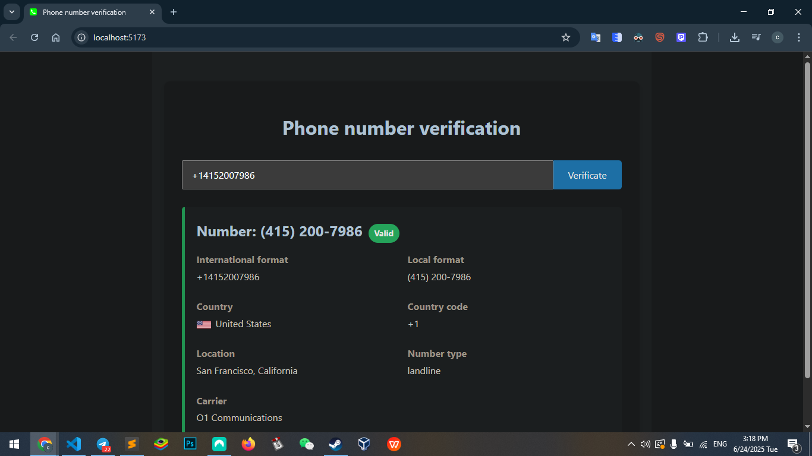

# Phone Number Validator

A web application that validates and provides detailed information about phone numbers using the [Phone Validation API](https://docs.abstractapi.com/phone-validation).

 <!-- Add your screenshot here -->


## Features

✅ International format detection  
✅ Country and carrier identification  
✅ Location information  
✅ Phone type detection (mobile/landline/voip)  
✅ Clean, responsive interface  

## Usage
1. Go to https://compuser21.github.io/phone-validator/
   
2.  Enter a phone number
    
3.  The validator will automatically:
    
    -   Verify if the number is valid
        
    -   Format it in international and local standards
        
    -   Identify the country and carrier
        
    -   Determine the phone type
        
    -   Provide geographic location when available

## Example Validation Output

```json
{
  "phone": "+14152007986",
  "valid": true,
  "format": {
    "international": "+14152007986",
    "local": "(415) 200-7986"
  },
  "country": {
    "code": "US",
    "name": "United States",
    "prefix": "+1"
  },
  "location": "San Francisco, California",
  "type": "landline",
  "carrier": "O1 Communications"
}
